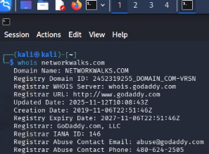
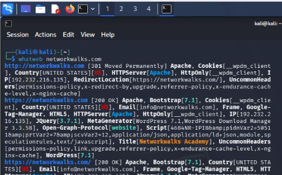
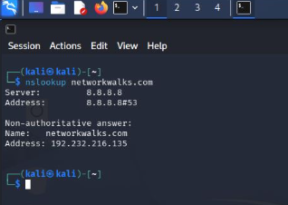
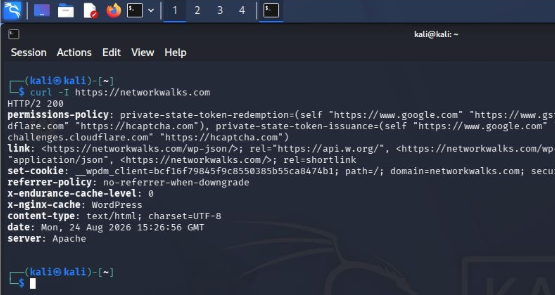
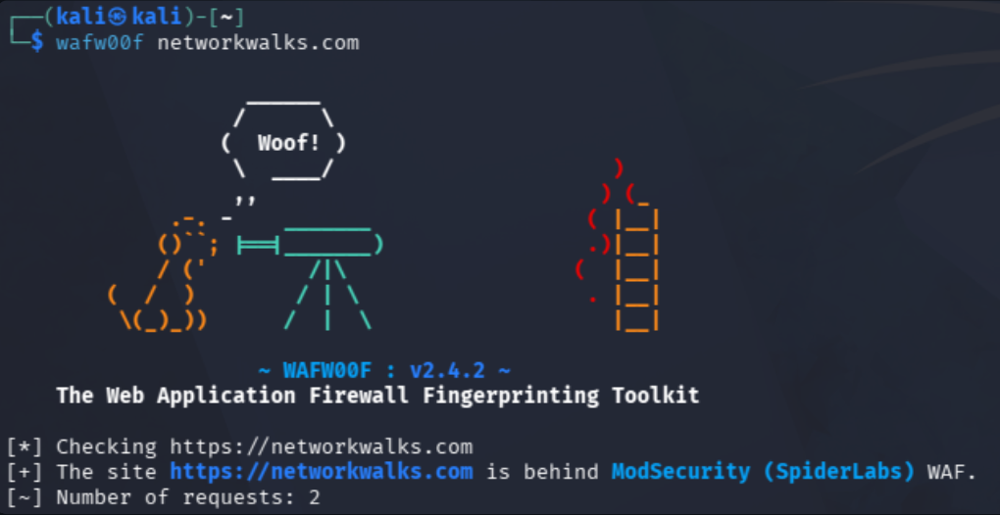
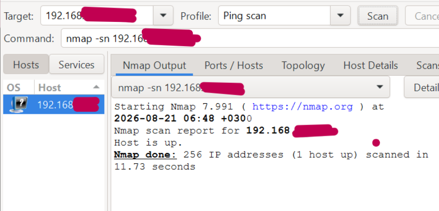
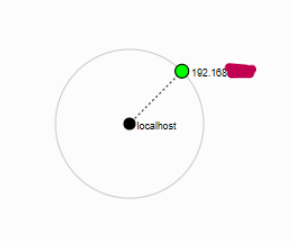

# Penetration Testing: Footprinting & Network Discovery (Week 2)

**Author:** Suraya Azeez  
**Program:** Networkwalks Cybersecurity Internship  
**Batch:** B082  
**Date:** August 2026  

---

## 🛠️ Project Scope & Objectives
This repository documents the practical work completed during **Week 2** of the Networkwalks Cybersecurity Internship. The primary objective was to execute early-stage penetration testing methodologies: passive intelligence gathering against a public domain and active host discovery across a local network segment.

The lab work is divided into two primary modules:
1. **Module 1 (W2-PM1):** Footprinting & Reconnaissance using Kali Linux CLI tools.
2. **Module 2 (W2-PM5):** Subnet Scanning & Topology Mapping using Zenmap (Nmap GUI).

---

## 📊 Technical Execution & Findings

### Module 1 — Passive Reconnaissance (Kali Linux)
Passive reconnaissance was conducted against `networkwalks.com` to gather target intelligence without interacting directly with application business logic:

* **Domain Ownership (`whois`):** Extracted domain registrar information, key creation/expiry timestamps, and authoritative name servers.  
  

* **Technology Stack Fingerprinting (`whatweb`):** Identified underlying web infrastructure, including Apache web server configuration, WordPress CMS (v7.0.4), and active frontend scripts.  
  

* **DNS Address Resolution (`nslookup`):** Resolved target hostnames to their public-facing IPv4 address (`192.232.216.135`).  
  

* **HTTP Header Analysis (`curl -I`):** Evaluated server response headers, revealing backend caching behavior and exposed endpoints such as `/wp-json/`.  
  

* **WAF Inspection (`wafw00f`):** Detected active Web Application Firewall enforcement protecting the target (ModSecurity by SpiderLabs).  
  

* **DNS Infrastructure Mapping (`dnsrecon`):** Performed comprehensive DNS record harvesting to map mail exchangers (MX), name servers (NS), SOA records, and SPF policies.  

---

### Module 2 — Active Network Scanning (Zenmap)
Active discovery was conducted within a local network environment to identify online assets and model internal layout:

* **Subnet Host Enumeration:** Utilized Windows `ipconfig` to determine the local LAN scope, followed by an Nmap Ping Scan (`nmap -sn`) in Zenmap to map active hosts, IP assignments, and physical MAC addresses.  
  

* **Network Topology Visualization:** Visualized host node relationships and exported the resulting network structure diagram.  
  

---

## 🔒 Security Impact & Recommendations
* **Information Exposure:** Public technical details (such as specific CMS versions and server banners) can assist adversaries during threat profiling.
* **Defensive Action:** Implement strict HTTP header hardening, review public DNS exposure, maintain regular patching cycles, and monitor internal network segments for unauthorized hosts.

---

## ⚖️ Disclaimer
All scanning and reconnaissance tasks documented herein were executed exclusively within authorized lab environments and target scopes for educational purposes.
